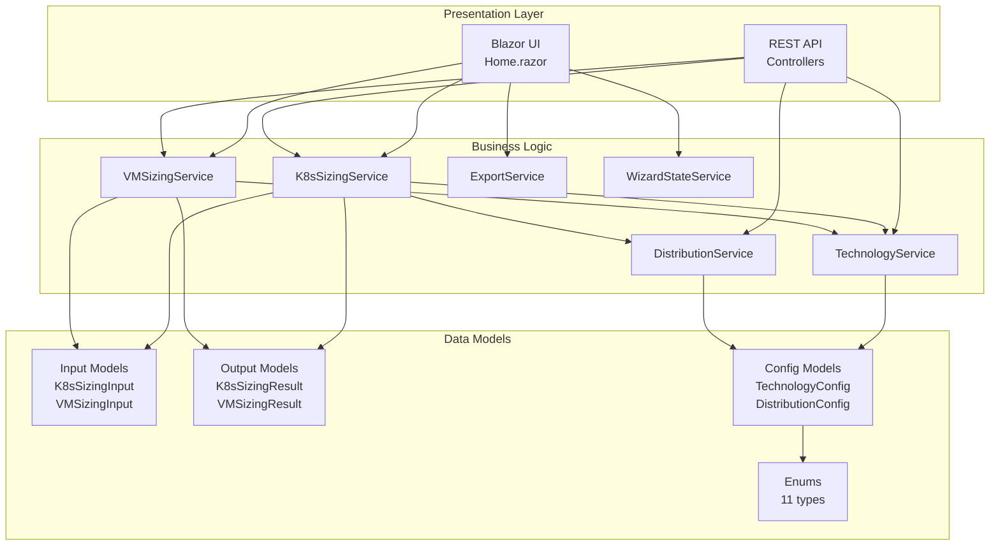
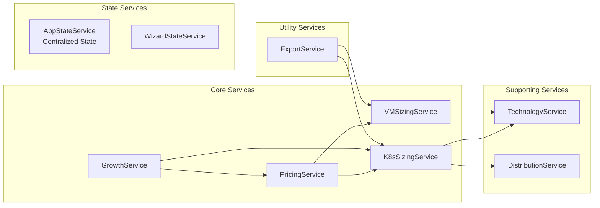
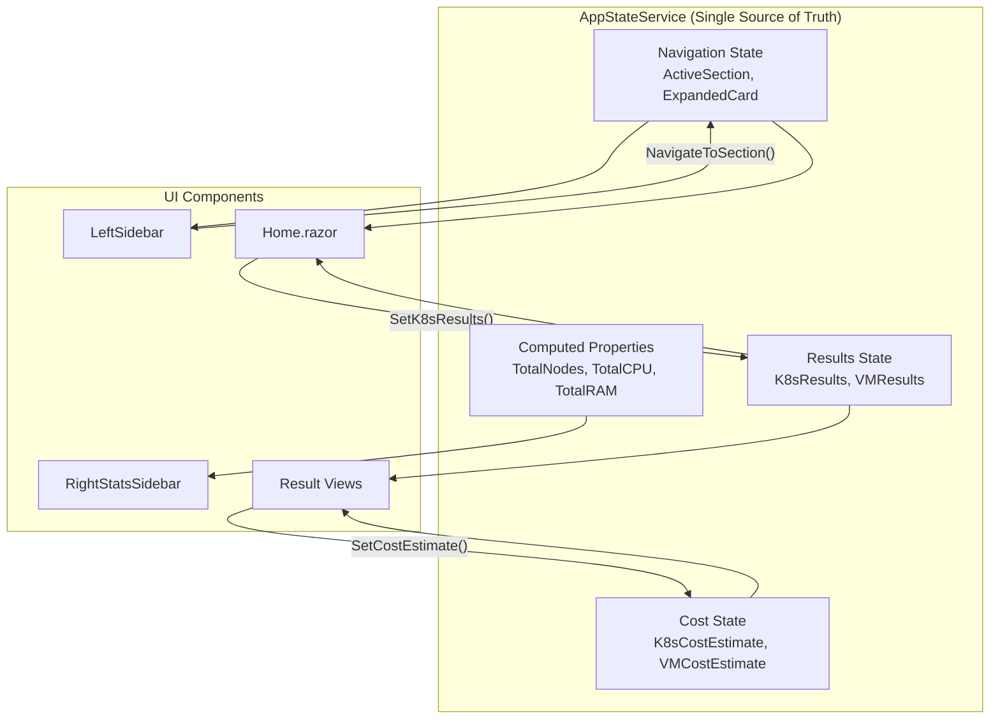
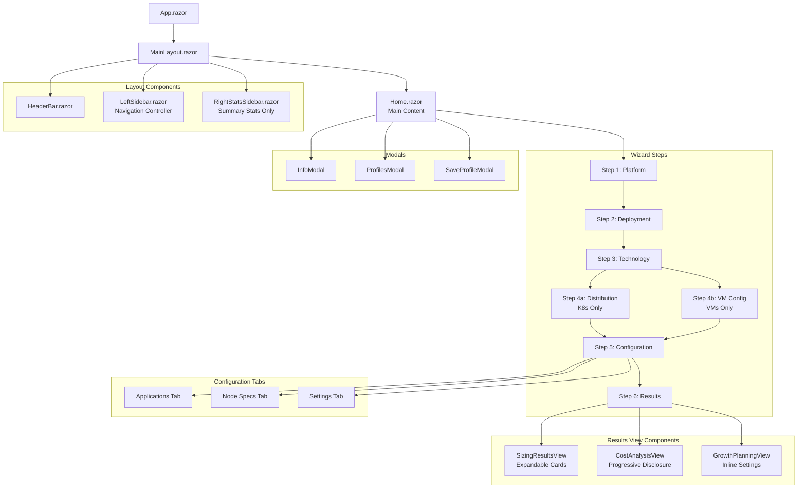
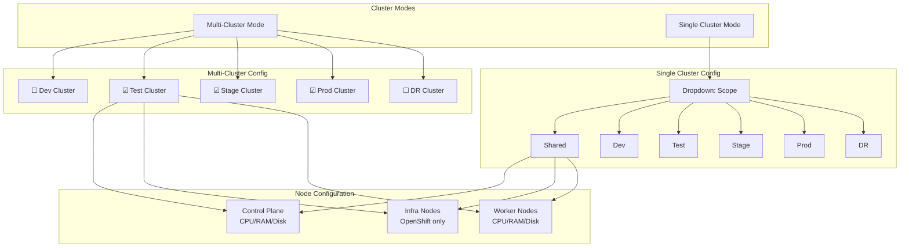
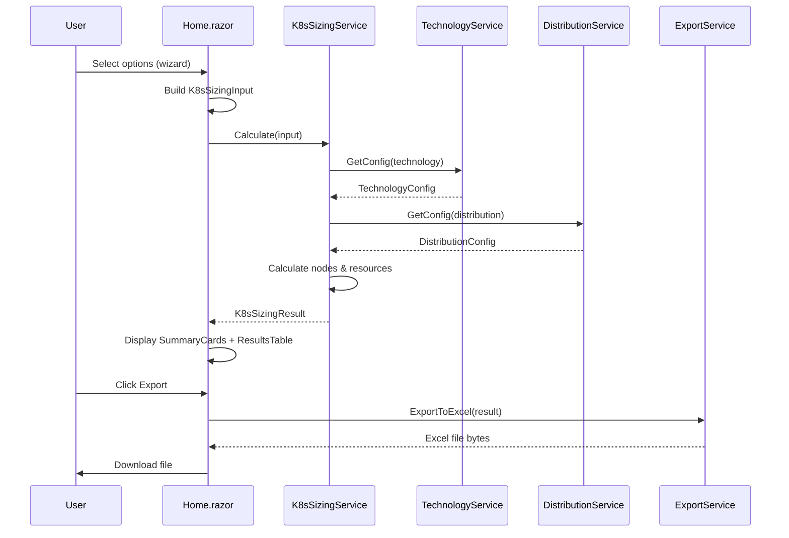
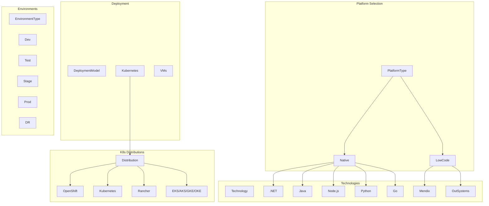

# Component Diagrams

## Solution Architecture



## Service Dependencies



## State Management Architecture



### State Management Principles

1. **Single Source of Truth**: All state lives in `AppStateService`
2. **Results Persist**: Navigation does NOT reset results
3. **Explicit Reset**: Only `ResetResults()` clears data
4. **Event-Driven Updates**: Components subscribe to `OnStateChanged`
5. **Computed Properties**: Summary stats derived from current state

## UI Component Hierarchy



### Three-Panel Layout

```
┌─────────────────────────────────────────────────────────────────────┐
│ HEADER: Logo | Context Breadcrumb | Theme Toggle              56px │
├────────────┬──────────────────────────────────────┬─────────────────┤
│            │                                      │                 │
│  SIDEBAR   │         MAIN CONTENT                 │  STATS PANEL    │
│  (200px)   │         (flexible)                   │  (260px)        │
│            │                                      │                 │
│ Navigation │  Content based on sidebar            │  Summary Only   │
│ ONLY       │  selection:                          │  (no duplication│
│            │  - Config steps                      │  of main content│
│            │  - SizingResultsView                 │                 │
│            │  - CostAnalysisView                  │  - Total Nodes  │
│            │  - GrowthPlanningView                │  - Total CPU    │
│            │                                      │  - Total RAM    │
│            │  Uses progressive disclosure         │  - Monthly Cost │
│            │  and expand/collapse                 │  - Warnings     │
│            │                                      │                 │
└────────────┴──────────────────────────────────────┴─────────────────┘
```

## Cluster Mode Configuration



## Data Flow



## Enum Relationships


