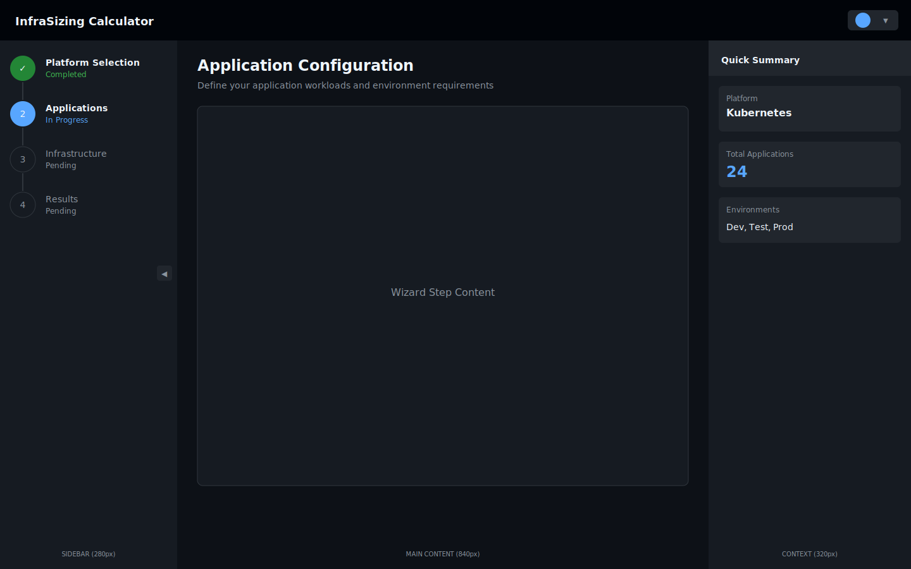
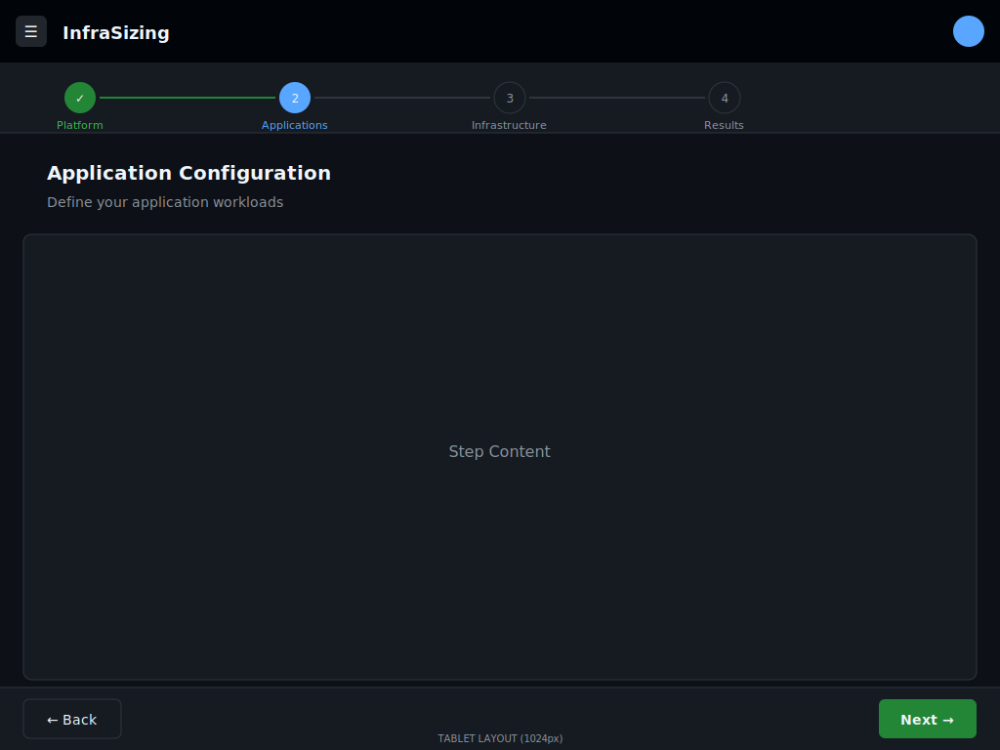

# SVG Wireframes

This folder contains SVG (Scalable Vector Graphics) wireframes for the Infrastructure Sizing Calculator UX redesign.

## Files

| File | Description |
|------|-------------|
| `01-layout-desktop.svg` | Desktop 3-panel layout (1440px+) |
| `02-layout-tablet.svg` | Tablet layout with horizontal progress (768-1024px) |
| `03-layout-mobile.svg` | Mobile layout with bottom navigation (<768px) |
| `04-wizard-platform.svg` | Platform selection step |
| `05-wizard-applications.svg` | Applications configuration step |
| `06-results-sizing.svg` | Sizing results overview |
| `07-results-cost.svg` | Cost analysis view |
| `08-results-growth.svg` | Growth projections |
| `09-scenarios.svg` | Scenarios management |
| `10-settings.svg` | Settings page |

## Viewing the Wireframes

### Option 1: Browser
Simply double-click any `.svg` file to open it in your default browser. All modern browsers support SVG natively.

### Option 2: VS Code
Install the "SVG Preview" extension to view SVGs directly in VS Code.

### Option 3: Vector Graphics Editors
Open in:
- **Inkscape** (free, open source)
- **Adobe Illustrator**
- **Figma** (import as vector)
- **Sketch**
- **Affinity Designer**

### Option 4: View All at Once
Create an HTML file that embeds all SVGs:

```html
<!DOCTYPE html>
<html>
<head>
  <title>UX Wireframes</title>
  <style>
    body { background: #0d1117; padding: 20px; }
    img { max-width: 100%; margin: 20px 0; border: 1px solid #30363d; }
    h2 { color: #f0f6fc; }
  </style>
</head>
<body>
  <h2>01 - Desktop Layout</h2>
  

  <h2>02 - Tablet Layout</h2>
  

  <!-- Add more as needed -->
</body>
</html>
```

## SVG Advantages

| Advantage | Description |
|-----------|-------------|
| **Scalable** | Vector graphics maintain quality at any zoom level |
| **Universal** | Opens in any browser, editor, or design tool |
| **Lightweight** | Text-based format with small file sizes |
| **Editable** | Can be edited in any text editor |
| **Embeddable** | Can be used directly in HTML documents |
| **Version Control** | Text-based XML works well with Git |
| **Accessible** | Supports `<title>` and `<desc>` for screen readers |

## Design System

The wireframes use a consistent dark theme color palette:

| Token | Value | Usage |
|-------|-------|-------|
| `bg-primary` | `#0d1117` | Main background |
| `bg-secondary` | `#161b22` | Card/panel background |
| `bg-tertiary` | `#21262d` | Elevated surfaces |
| `bg-header` | `#010409` | Header background |
| `border` | `#30363d` | Default borders |
| `text-primary` | `#f0f6fc` | Primary text |
| `text-secondary` | `#8b949e` | Secondary text |
| `accent-primary` | `#58a6ff` | Blue accent |
| `accent-success` | `#238636` | Green accent |
| `text-warning` | `#d29922` | Warning text |
| `text-danger` | `#f85149` | Error/danger text |

## Comparison with Other Formats

| Format | Location | Best For |
|--------|----------|----------|
| HTML/CSS | `../html/` | Interactive prototyping, browser testing |
| Excalidraw | `../excalidraw/` | Quick sketching, collaboration |
| Figma Specs | `../figma/` | Design handoff, component specs |
| **SVG** | `../svg/` | Universal viewing, vector editing |

## Editing Tips

### Using Inkscape (Free)
1. Open any `.svg` file
2. Edit shapes, colors, text directly
3. Save as SVG (optimized)

### Using Code Editor
1. Open `.svg` in VS Code or similar
2. Find elements by their `id` or CSS class
3. Modify `fill`, `stroke`, `font-size`, etc.
4. Preview changes in browser

### Changing Colors
Replace color values in the `<style>` block at the top of each SVG:

```xml
<style>
  .bg-primary { fill: #YOUR_COLOR; }
  .text-primary { fill: #YOUR_COLOR; }
</style>
```

---

*Generated for the InfraSizing Calculator UX Wireframes project*
